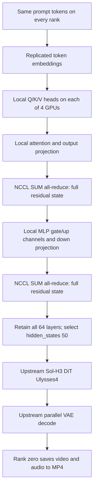

# How Sol-H3 was adapted for RTX PRO 6000

The encoder tensor-parallel design below describes the original **T2V** campaign. The later [I2V/Ref2VA extension](IMAGE_TESTS.md) uses whole-layer encoder distribution after the original TP variant failed full multimodal parity. DiT Ulysses4 remains shared by both campaigns.

## 1. Identify what was actually running out of memory

Starting four `torchrun` processes does not pool four devices into a single transparent 384GB memory space. A tensor still lives on a particular device unless the program explicitly partitions it.

At the pinned upstream revision, the engine loads pipeline components, moves them to each local CUDA device, then configures the DiT's Ulysses parallelism. Every process initially owns the full text encoder. The approximate initial weight budget per GPU was:

| Component | Initial weight storage on a GPU |
|---|---:|
| Main DiT | about 61.7 GiB |
| Full Qwen3-VL encoder, including its other retained components | 62.13 GiB |
| Video and audio VAEs after BF16 loading | about 5.1 GiB combined |
| Total lower bound | **about 128.96 GiB** |

This is a weight estimate, not peak runtime memory. It excludes activations, temporary tensors, LoRA fusion, compiler workspaces and allocator fragmentation. Four actual ranks failed with CUDA OOM during `self.pipe.to(self.device)`, before any generation. The OOM log reported approximately 94.94 GiB in use against 94.97 GiB capacity.

Sol-H3's later AdaLN precomputation releases projection weights, but the original loader must fit before it reaches that optimization. Moving an already oversized pipeline first cannot be repaired by a later memory saving.

The retained fix therefore runs **after CPU component loading and before `.to(cuda)`**. CPU loading is still replicated across processes; this adaptation is not a memory-efficient checkpoint streaming loader.

## 2. Resolve every T2V component from the chosen model directory

The first attempt failed before the memory test because modular component metadata retained remote repository locations. Passing a local path to the outer pipeline was insufficient for that loading path.

The patch adds `pretrained_model_name_or_path=model_path` to `load_components`, alongside BF16 dtype. This makes T2V component resolution use the explicitly staged, pinned Diffusers model directory. It supports running with the Hub offline flags once all required files are downloaded.

This is a loader-location correction. It does not convert weights or change the scheduler.

## 3. Partition the Qwen3-VL attention and MLP projections

The new `h3_runtime/encoder_tp.py` implements the same basic column/row tensor-parallel mathematics used by vLLM-style encoders. It works directly with the pinned Transformers model; it does not start a vLLM server or import vLLM at runtime.

For a PyTorch linear layer, the stored weight has shape `[out_features, in_features]` and the forward operation is `y = x @ W.T + b`.

| Projection | Partition of stored weight | Local work | Communication |
|---|---|---|---|
| Attention Q, K, V | output dimension, `W[local_rows, :]` | local query/KV heads | none at these projections |
| Attention output `o_proj` | input dimension, `W[:, local_columns]` | local contribution to full hidden width | SUM all-reduce |
| MLP `gate_proj`, `up_proj` | output dimension | local intermediate channels | none at these projections |
| MLP `down_proj` | input dimension | local contribution to full hidden width | SUM all-reduce |

After a column partition, each rank keeps its local activation slice. After a row partition, each rank produces a partial full-width result. Summing those partial results reconstructs the residual-stream value on every rank. For a row-parallel layer with a bias, the code adds the bias **after** the all-reduce, so it is added once rather than multiplied by the number of ranks.

For this encoder, `num_attention_heads=64`, `num_key_value_heads=8`, and `intermediate_size=25600`. With four ranks, each receives 16 query heads, 2 KV heads and 6,400 MLP intermediate channels. Grouped-query attention keeps its 8:1 query-to-KV relationship. The divisibility checks are explicit in the patch.

Each layer has two row-parallel reductions: one for attention output and one for the MLP output. Residual states remain replicated. This is cooperative inference on one request, not four independently generated clips.

## 4. Preserve the encoder's hidden-state contract

The diffusion pipeline consumes `hidden_states[50]`. In the full 64-layer Transformers model, that is an intermediate hidden state before the model's final output normalization. Reducing `num_hidden_layers` to 50 and then taking the last returned hidden state can change this contract because the final hidden state is normalized.

This adaptation retains all 64 layers and the original selection semantics. Token embeddings, normalization layers, vision components and the other unsharded parameters remain replicated. All encoder weights retain BF16 precision. The LM output head and vision module remain allocated even though the tested text-only requests do not need their full functionality.

vLLM-Omni has a broader dedicated encoder implementation, including its own handling of the selected layer, embeddings and process groups. Here the approach was deliberately adapted to the existing Transformers/Sol-H3 path; it is not a wholesale copy of that implementation. The local patch is 61 lines of sharding code plus the engine integration and local loading fix.

## 5. Memory outcome

| Quantity | Bytes | GiB |
|---|---:|---:|
| Full encoder before sharding | 66,714,780,128 | 62.13 |
| Encoder retained per rank after TP4 | 19,906,347,488 | 18.54 |
| Encoder weight reduction per rank | 46,808,432,640 | 43.59 |

The full encoder numbers include components outside `language_model`. The sharding function itself reports a narrower accounting: language-model parameters go from 63,968,421,888 to 17,159,989,248 bytes. Do not confuse those two scopes.

Replacing the full encoder with its TP4 share lowers the approximate initial total weight requirement from 128.96 to 85.37 GiB per rank. This is why the loader can proceed. It does not imply that 10 GiB is always free during compilation or generation: sampled `nvidia-smi` peaks in the successful campaign were 94,833 / 96,567 / 96,523 / 96,523 MiB across ranks 0–3. The loading and warmup peaks still require nearly the entire card.

No CPU inference offload, new weight quantization, retraining or checkpoint conversion was introduced. The model files on disk remain original. CPU-side sharding creates new local parameter storage in each worker and releases the superseded local references.

## 6. Preserve and credit the upstream acceleration stack

The following behavior was already implemented by Sol-H3 and was kept in the measured profile:

| Upstream feature | Configuration used here |
|---|---|
| Distilled adapter | FastH3 dense-datafree preview; rank 64, scale 1 |
| Sampling | five scheduler points, **four actual DiT forwards** |
| Scheduler shifts | video 12.0; audio 3.0 |
| DiT parallelism | Ulysses degree 4; variable sequence lengths supported |
| Attention | SOL/BSA, `tau=1.0`, prefix sink |
| Dense policy | first step and first two layers dense |
| QKV transport | INT8 QKV on all calls |
| Attention output transport | FP8 |
| Other runtime work | fused operators, AdaLN precomputation, parallel VAE decoding and MP4 encoding |

The 50-layer DiT runs four forwards: 200 attention-layer invocations per rank per request. The dense first step accounts for 50; the first two layers in the other three steps account for another 6. That leaves **144 sparse calls**, or 72% of layer invocations. This percentage is not the fraction of attention elements retained: selected block density is separately measured and prompt-dependent.

The upstream audit has cumulative counters and a previous-request sparse counter. The latter is null on the first warmup. The portable checks validate cumulative sparse/dense totals against completed request count (144/56 per request), including that first warmup; they do not mistake a null previous-request field for a missing sparse kernel.

Ulysses distributes sequence work and trades sequence slices for attention-head slices through all-to-all communication. It does not divide all DiT parameter storage by four. The original DiT/VAE implementations remain upstream code.

The patch's main contribution is making that existing fast profile fit and execute on these cards. There is no successful unpatched RTX run from which to measure an isolated speedup caused by the patch.

## 7. Separate GPU math from benchmark coordination

An intermediate attempt saved a valid 124-frame MP4, then stalled in post-save coordination. That attempt is excluded from timing results.

The successful runner uses NCCL for GPU collectives and a separate Gloo process group for CPU-side barriers and `all_gather_object` of audit metadata. Other ranks wait on this CPU control group while rank zero finishes MP4 encoding. This changes benchmark orchestration, not the model's arithmetic.

The upstream writer creates fragmented MP4 files, where `ffprobe` may omit `nb_frames`. Validation uses `ffprobe -count_frames` and `nb_read_frames`, followed by a complete audio/video decode. A missing header frame count is not treated as a corrupt video.

## 8. What was validated

The four-rank sequence was: exact NCCL all-to-all probe; upstream BSA numerical gate on a small SM120 shape; tiny Qwen FP32/BF16 comparison; full-checkpoint BF16 comparison of the three actual prompts; then 12 complete renders with per-rank audits and media validation.

Full-checkpoint relative L2 errors at `hidden_states[50]` were 0.004648, 0.002502 and 0.002739 against a 0.02 implementation gate. Reduction order changes floating-point results; these are not bitwise matches. The precise values, maximum absolute errors and all-rank records are included in [the evidence](../benchmarks/2026-09-07/numerical_checks.json).

Validated scope is text-to-video with native audio, at 5 and 10 seconds, on four RTX PRO 6000 Blackwell Server Edition cards. I2V, Ref2VA, 15-second output, other RTX 6000 generations and eight-GPU generation are outside this measured campaign.
