# Image-to-video and reference-to-video tests

This extension tests the same four RTX PRO 6000 Blackwell Server Edition GPUs with native audio, 1344×768, 24 FPS and seed 42. It adds four cases: a chef first frame at 5 and 10 seconds, an observatory reference at 5 seconds, and a two-reference neon street scene at 10 seconds. Each case has one warmup followed by three measured requests. Human quality review is separate from successful execution and numerical checks.

## Measured results

| Case | Sol-H3 median to MP4 | Historical vLLM4 | Timing ratio |
|---|---:|---:|---:|
| I2V: chef, 5 seconds | **13.76 s** | 39.16 s | **2.85×** |
| I2V: chef, 10 seconds | **30.74 s** | 92.89 s | **3.02×** |
| Ref2VA: observatory, 5 seconds | **12.49 s** | 61.55 s | **4.93×** |
| Ref2VA: neon street, 10 seconds | **27.66 s** | 153.65 s | **5.56×** |

Each row is the median of three complete requests after its own warmup. All 16 outputs passed full AV decoding, frame/codec/audio checks and all-rank profile audits. All four public representative MP4s and all four input images were checked byte-for-byte.

| Case | Prompt/image encoder | Reference VAE | DiT | Video decode | Audio decode |
|---|---:|---:|---:|---:|---:|
| I2V: chef, 5 seconds | 0.342 s | 0.263 s | 10.788 s | 1.687 s | 0.036 s |
| I2V: chef, 10 seconds | 0.342 s | 0.262 s | 25.288 s | 3.355 s | 0.062 s |
| Ref2VA: observatory, 5 seconds | 0.407 s | 0.083 s | 9.640 s | 1.688 s | 0.036 s |
| Ref2VA: neon street, 10 seconds | 0.708 s | 0.141 s | 22.179 s | 3.361 s | 0.063 s |

Stage medians are reported independently and need not sum exactly to the full-request median, which also includes input/setup and MP4 work. See [all original run records](../benchmarks/2026-09-07-images/measurements.json), [accepted and rejected numerical checks](../benchmarks/2026-09-07-images/numerical_checks.json), and [final validation](../benchmarks/2026-09-07-images/campaign_validation.json).

## Why the image encoder needed another change

The original text-only campaign used tensor parallelism inside each Qwen3-VL decoder layer. Its three text prompts passed the full BF16 encoder check with relative L2 error of 0.25–0.46%. Those results remain valid for those exact text prompts.

Image-conditioned prompts exposed larger errors. We ran the exact I2V first-frame presentation and Ref2VA reference preprocessing against the original full BF16 checkpoint, comparing the hidden state at index 50 and modality tags. The original TP4 variant produced relative L2 errors of 3.26% for the chef, 15.22% for the observatory and 4.17% for the neon scene. All outputs were finite and tags matched, but they failed the existing 2% numerical gate. We did not increase the threshold or generate benchmark clips with this variant.

An intermediate experiment used BF16 matrix inputs and weights with FP32 row-parallel GEMM output and FP32 all-reduce, followed by one BF16 cast. It improved the observatory case to 0.93%, but the chef and neon cases remained above the gate at 3.53% and 2.33%. The experiment is preserved in the numerical evidence; it is not enabled in the final image patch.

The accepted solution assigns **whole decoder layers** to GPUs. GPU0 owns layers 0–15, GPU1 owns 16–31, GPU2 owns 32–47 and GPU3 owns 48–63. The owner executes the original layer, then broadcasts its BF16 output. Every process retains the ordered layer objects and receives each hidden state, so Transformers' hidden-state capture and Qwen's DeepStack image additions retain their original contract. The visual encoder, embedding table and final components remain replicated. No decoder layer is dropped, no encoder weights are quantized, and no inference layer is offloaded to CPU.

This is sequential layer distribution for one encoder request; it does not claim fourfold encoder compute speedup or pipelined microbatch throughput. It reduces resident encoder weight memory to approximately 18.54 GiB per GPU while keeping the original GEMM shapes. DiT still uses Ulysses4 to process each denoising forward in parallel across all four GPUs. Video decoding retains the upstream parallel implementation.

The complete multimodal check was **bit-exact on all four ranks for all four cases**: relative L2 = 0, maximum absolute difference = 0, modality tags equal. This is evidence for the tested prompts, images, software and hardware. It does not establish visual quality, speech fidelity or bitwise reproducibility on arbitrary hardware.

```mermaid
flowchart LR
    A[Prompt and source images] --> B[Replicated vision encoder]
    B --> C[GPU0: Qwen layers 0–15]
    C --> D[GPU1: layers 16–31]
    D --> E[GPU2: layers 32–47]
    E --> F[GPU3: layers 48–63]
    F --> G[Hidden state 50 on every rank]
    G --> H[Four DiT forwards with Ulysses4]
    H --> I[Video and audio decode]
    I --> J[Complete MP4]
```



Each encoder layer broadcasts its output to all ranks; the arrows show execution ownership, not only neighbor-to-neighbor transfer. The hidden-state collector retains the earlier index-50 value even though all 64 layers execute.

## Task-specific generation profiles

| Setting | I2V | Ref2VA |
|---|---|---|
| Runtime task | `i2v` | `ref2va` |
| DiT partition | `transformer` | `transformer_ref` |
| Adapter | FastH3 Preview v1 dense-datafree | LightX Ref2V Turbo four-step BF16 |
| Conditioning | One first frame | One or more reference images |
| DiT forwards | 4 | 4 |
| Sparse/dense attention calls per request, per rank | 144 / 56 | 200 / 0 |
| Dense startup steps / layers | 1 / 2 | 0 / 0 |
| Sparse sink mode | `prefix` | `text_audio` |
| Weights / QKV wire / output wire | BF16 / INT8 / FP8 | BF16 / INT8 / FP8 |
| Encoder distribution | Whole layers, 16 per GPU | Whole layers, 16 per GPU |

I2V uses the upstream default FastH3 adapter with native first-frame conditioning. That adapter was trained for T2V; this is an **I2V compatibility test**, not a claim that it is an I2V-trained adapter. Ref2VA uses the dedicated reference transformer and `minimax_h3_ref2v_turbo_4step_v0.1_bf16.safetensors`. The LightX checkpoint records rank 128 and alpha 8; the runtime keeps upstream fusion behavior. Four DiT evaluations use five scheduler points and the upstream video/audio shifts of 12/3.

The chef image is prepared on the output canvas using the upstream I2V path. Ref2VA uses upstream `reference_image_resize_mode='match'`, preserving aspect ratio and limiting reference area to the selected output canvas without upscaling. The previous vLLM image tests used a 2048-pixel reference short edge. Input file hashes are identical, but the tensors after preprocessing differ.

The runtime and task defaults come from the [pinned Sol-H3 source](https://github.com/NVlabs/Sana/tree/2936c47637380842aaa4a4488fac5006cc542b70/models/minimax_h3/Sol-H3). The [official project page](https://nvlabs.github.io/Sana/Sol-Engine/Sol-H3/) describes T2V, first-frame I2V and Ref2VA support. Its B300 timing table is reference-free T2VA and excludes MP4 encoding; those numbers are not RTX image benchmarks.

## Reproduce the image campaign

First install the environment and download the base model and FastH3 adapter using [REPRODUCE.md](REPRODUCE.md), sections 1 and 3. Keep the same pinned dependencies. If you already completed the T2V setup, retain its source and results. The image extension uses a separate checkout to avoid replacing the original patch.

```bash
source .venv/bin/activate
export SANA_ROOT="$PWD/vendor/Sana-image"
export H3_MODEL_ROOT="$PWD/models/MiniMax-H3"
export H3_ADAPTER_PATH="$PWD/models/FastH3/dense-datafree/adapter_model.safetensors"
export H3_REF_MODEL_ROOT="$PWD/models/MiniMax-H3-Ref2VA"
export H3_REF_ADAPTER_PATH="$PWD/models/LightX/minimax_h3_ref2v_turbo_4step_v0.1_bf16.safetensors"
export H3_RUN_ROOT="$PWD/runs/images4"
python scripts/setup_image_source.py
python scripts/download_image_models.py
```

The image patch is cumulative: original local-loader and encoder-TP support plus the new opt-in whole-layer encoder. Apply it once to a clean checkout of the pinned upstream revision; do not stack it on top of the original TP patch. `setup_image_source.py` does this and refuses to replace an existing checkout.

The additional Ref2VA model and adapter require **67,664,247,018 bytes** beyond the base/T2V setup, plus images and outputs. Shared components are symlinked to the verified base directory. Native ComfyUI/vLLM model formats are not converted or evicted. Plan additional free storage and retain the host-RAM provisions in the main reproduction guide. The downloader records exact repository revisions in [image_weights.json](../configs/image_weights.json), verifies SHA256 for large files and images, and Git blob identities for small model files. Source images are downloaded from the pinned ModelTC examples; no private workspace is required.

After downloads finish, reserve the four GPUs exclusively and run the gates:

```bash
export CUDA_VISIBLE_DEVICES=0,1,2,3
export OMP_NUM_THREADS=4
export HF_HUB_OFFLINE=1
export TRANSFORMERS_OFFLINE=1
export H3_ENCODER_TP=0
export H3_ENCODER_PP=1
export H3_ULYSSES_COMM_DTYPE=int8_qkv
export H3_ULYSSES_INT8_SCOPE=all
export H3_ULYSSES_OUTPUT_DTYPE=fp8
export SOL_ATTN_STRICT=1
mkdir -p "$H3_RUN_ROOT"
python scripts/preflight.py --gpus 4
torchrun --standalone --nproc_per_node=4 scripts/probe.py
torchrun --standalone --nproc_per_node=4 scripts/test_encoder_pp.py
torchrun --standalone --nproc_per_node=4 scripts/validate_encoder_multimodal.py
python scripts/run_image_campaign.py --task i2v --attempt i2v_a1
python scripts/run_image_campaign.py --task ref2va --attempt ref2va_a1
```

To revalidate completed files and print their medians, run `python scripts/summarize_image.py "$H3_RUN_ROOT/i2v_a1"` and the corresponding command for `ref2va_a1`.

The two launch commands run sequentially. Each mode keeps its own model resident for two cases, producing eight files per mode: two warmups and six measurements. The full multimodal gate loads the original encoder first on rank zero; allow several minutes for CPU loading even after the checkpoint progress bar reaches 100%. The original run reused saved full BF16 reference tensors between numerical experiments after checking prompt/input provenance. A fresh replication generates its own full reference by default.

The launcher requires local passing multimodal parity and SM120 probes, verifies source-image hashes, checks exclusive GPU use and records the launch environment, exact runner and runtime diff. Outputs appear at `H3_RUN_ROOT/<attempt>/<case>/<warmup|repeat1|repeat2|repeat3>/`. Use a new attempt name for retries. Do not relabel a partial attempt as a full benchmark.

## Timing and quality interpretation

Full-request time begins before reading source images and constructing references, and ends after MP4 saving and the post-save control barrier. It includes prompt/image encoding, denoising and video/audio decoding. No prompt embedding cache or image cache is introduced. All three measured I2V repeats were byte-identical within each duration. Each Ref2VA group had two distinct MP4 hashes across its three repeats, so seed 42 does not guarantee bitwise deterministic full generation. The public representative is always repeat 1. Model loading, warmup, ffprobe and post-render full AV validation are excluded. Every record includes stage times, memory peaks, all four ranks' DiT/attention audits, prompt/input/output hashes and media metadata.

Sol-H3 emits 124 frames for the 5-second setting and 243 for the 10-second setting, at 24 FPS. Historical vLLM4 emitted 120/240 frames and used eight-step LightX profiles on another host. Adapter, sampler, attention, reference preprocessing and native duration differ. Ratios against that history compare complete configurations; they do not isolate a runtime optimization or demonstrate equivalent quality.

A sampled early observatory frame shows a strong bright glow around the eyes. The prompt requests a faint cold flash crossing the eyes; this may be an excessive interpretation and needs human review. This observation is from a frame spot check, not a full video/audio evaluation.

Review the chef's first frame and motion, the observatory's reference identity, and the neon subject and scene separately. The neon prompt requests exactly “The street is clear. Follow me.” during the speech window and ambience afterward. Check for extra speech, voice changes, lip-sync errors and reference drift. Successful AV decoding, low encoder error or zero ASR word error cannot accept these clips on the user's behalf.

## Eight GPUs

This image campaign measures four GPUs only. Whole-layer encoder distribution would assign eight decoder layers per device on eight ranks, further reducing weight memory, but the sequential layer compute would remain and broadcasts could cost more. DiT Ulysses8 and video decoding could improve, subject to PCIe/NUMA communication and shape divisibility. The original [eight-GPU forecast](EIGHT_GPU.md) applies to the earlier T2V measurements; do not reuse its seconds as image-test predictions. Measure stage times, full multimodal parity and media quality again on the actual eight-card host before making an image latency claim.
